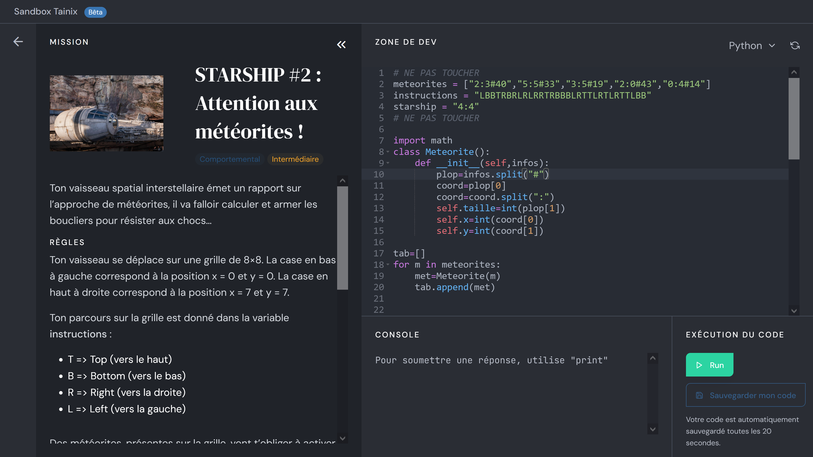

Challenge Python Tainix
==========
Tainix est un site proposant des challenges à résoudre via une API ou une sandbox en ligne.
Il y a 4 niveaux:  de starter à avancé pour se perfectionner en Python en s'amusant.

Fig1: Copie d'écran de la Sandbox d'un challenge Tainix
